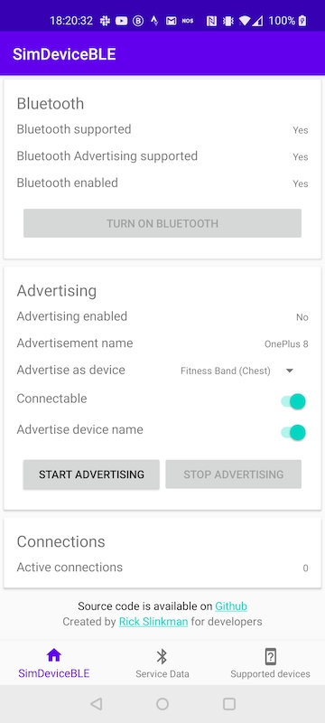
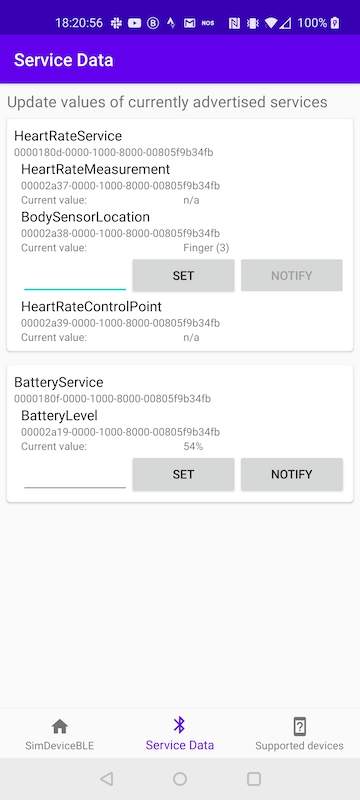

# SimDeviceBLE
Simulate a BLE device using this Android app

SimDeviceBLE allows developers to simulate Bluetooth devices with multiple GATT Services.   
This **app** allows full configuration of the BLE advertisement data and shows the amount of connected devices.   
The simulated device and the advertised data can be manipulated using the app UI or the **gRPC** interface.

Feel free to import the `app` module into your Android Studio project to simulate your own BLE peripherals.      
Contributing the proprietary devices, services and characteristics is appreciated but not required.     

## App
Checkout the project and open it with Android Studio.   
Run the `app` on your Android phone.   

Make sure Bluetooth is enabled on your phone (use `Enable Bluetooth` button) and advertise a selected device.   
The selected device will advertise the services associated to it.   
All options available in the `Advertise` section will be used in the Advertisement data.   

Characteristic values can be updated using the `Service Data` screen.   
All characteristics will be mapped to a View on the screen to show their current data value.   
Some characteristics will allow to update their value and notify all connected Central devices.   
Developers do not need to write their own View classes.   
Services and characteristics are introspected and Views are created dynamically.   




## gRPC
SimDeviceBLE defines a [gRPC](https://grpc.io/) interface to take control of the BLE device.   
Generate a client [in your preferred language](https://grpc.io/docs/languages/) to interact with the gRPC server in the app.   
All devices supported in the app can be advertised with a simple command.   
Update the advertised characteristic data to match your use case or test scenario.   
To notify all connected devices of an updated characteristic in SimDeviceBLE, call the associated `rpc`.

SimDeviceBLE has a `GrpcServerActivity` that can be used in an easy way.   
It is available via the options menu in the app.      

For usage in automation, please follow these steps:   
- Install the SimDeviceBLE app on an Android phone and connect to a PC using USB.   
- Run command `adb forward tcp:8910 tcp:8910`   
- Run command `adb shell am start -n nl.rwslinkman.simdeviceble/.grpc.GrpcServerActivity`   

```protobuf
service SimDeviceBLE {

    rpc listAvailableSimDevices(google.protobuf.Empty) returns (ListAvailableSimDevicesResponse) {}
    rpc startAdvertisement(StartAdvertisementRequest) returns (StartAdvertisementResponse) {}
    rpc stopAdvertisement(google.protobuf.Empty) returns (google.protobuf.Empty) {}
    rpc listAdvertisedCharacteristics(google.protobuf.Empty) returns (ListAdvertisedCharacteristicsResponse) {}
    rpc updateCharacteristicValue(UpdateCharacteristicValueRequest) returns (google.protobuf.Empty) {}
    rpc notifyCharacteristic(NotifyCharacteristicRequest) returns (google.protobuf.Empty) {}
}
```
Please refer to the `grpc/SimDeviceBLE.proto` file for the full specification of the gRPC interface.

## Automated testing
The module `cucumbertest` contains a basic app that is used as a testing vehicle to verify SimDeviceBLE.      
Tests written using the [Cucumber framework](https://github.com/cucumber/cucumber-android) are executed via this app.   

Execute the `androidTest` tests in the `cucumberTest` module to test the gRPC server.      
It requires a separate device running SimDeviceBLE in gRPC Mode.   
This mode can be found in the context menu of the SimDeviceBLE app.   

The Cucumber tests demonstrate a way SimDeviceBLE can contribute to your automated testing.   
Your project could create a similar configuration using the gRPC client.

## Contributing
Please feel free to add any devices in the `nl.rwslinkman.simdeviceble.device` package.   
All devices must implement the `Device` interface.  
The list of `services` can contain any of the classes implementing `Service`.   
They are defined in the `nl.rwslinkman.simdeviceble.service` package.    
Don't forget to add the new device in the `SimDevices.supportedDevices` list.   

When adding a new `Service`, please implement according to the Bluetooth SIG specification as much as possible.
Please keep in mind that the services might be used by multiple `Device` implementations.   

### Notice
BLE peripheral mode was introduced in Android 5.0 Lollipop.  
Due to hardware chipset dependency, some Android phones don't have access to this feature.   
This will be visible in the `Bluetooth` section on the Home screen.   